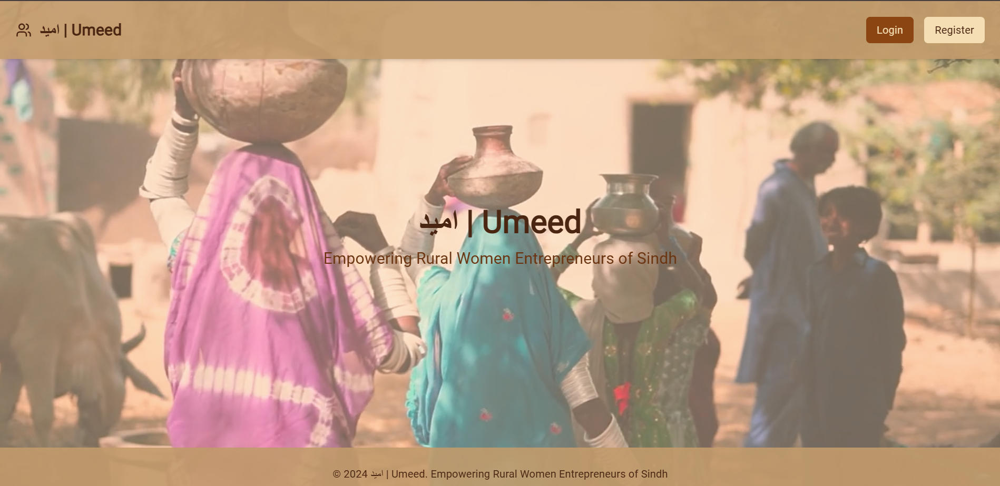
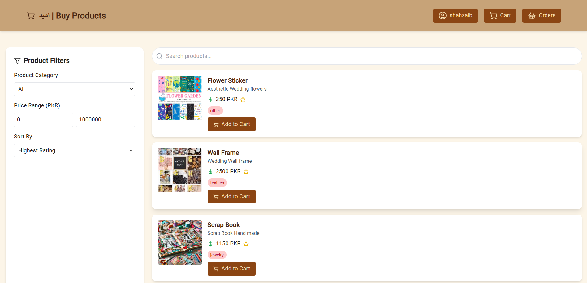

# امید | Umeed

Welcome to Umeed, the Rural Women Empowerment Marketplace! This marketplace is designed to empower women living in rural areas by providing them with a platform to showcase and sell their products and services.

## About

The Rural Women Empowerment Marketplace aims to bridge the gap between rural women entrepreneurs and potential customers. By creating an online marketplace, we enable these women to reach a wider audience and increase their economic opportunities.

## Features

- **Product Listings**: Rural women can create and manage their product listings, including images, descriptions, and pricing information.
- **Search and Filter**: Customers can easily search for specific products or filter listings based on categories, prices, and other criteria.
- **Seller Profiles**: Each seller has a dedicated profile page where they can showcase their brand, story, and other relevant information.
- **Community Support**: The marketplace fosters a supportive community where sellers can connect (`socket.io` is used for this purpose), share experiences, and seek advice.

## Getting Started

To get started with the Rural Women Empowerment Marketplace, follow these steps:

1. **Clone the Repository**: Clone this repository to your local machine using the following command:

    ```
    git clone https://github.com/malikshahzaib7238/Umeed
    ```

2. **Install Dependencies**: Navigate to the project directory and install the required dependencies by running the following command:

    ```
    npm install
    ```

3. **Configure Environment Variables**: Create a `.env` file in the client and server directory and configure the necessary environment variables, such as database connection details and API keys.

4. **Start the Application**: Start the application by running the following command:

    ```
    npm start
    ```

5. **Access the Marketplace**: Open your web browser and navigate to `http://localhost:3000` to access the Rural Women Empowerment Marketplace.

## Screenshots




These are a few screenshots to showcase the user interface of the Umeed app. They provide a glimpse of the various features and functionalities available in the application.

Feel free to explore the app and experience it. You can also contribute.

## Contributing

We welcome contributions to Velho Frontend! If you would like to contribute, please follow these guidelines:

1. Fork the repository
2. Create a new branch for your feature or bug fix
3. Commit your changes and push to your forked repository
4. Submit a pull request

## Support

If you have any questions, issues, or suggestions, please [open an issue](https://github.com/malikshahzaib7238/Umeed/issues) on GitHub. Our team will be happy to assist you.

## License

This project is licensed under the [MIT License](LICENSE).
